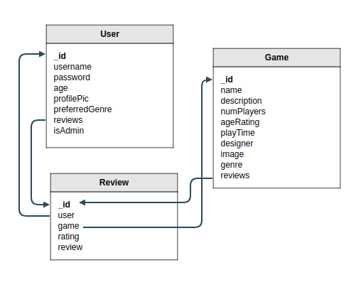

# FAD GAMES

FAD Games is a gaming review user-interface app. It allows users to learn about their favorite games as well as write reviews, rate games, edit, and delete games.

## Users Stories

* Users see home page and have access to Games, Users, New Games, New Users, New Reviews, and Login/Logout buttons on the home page (index/show)
* Users can create profile page and be authenticated by inputting username and password (new/create)
* Users can be Admins who are able to delete and edit users, games, and reviews
* Users can see link to games (index)
* Users can read and write reviews (index/post)
* Users can edit a review (edit/update)
* Users can delete a review (destroy)
* Users can create games (post)
* Users can edit a game (edit/update)

## Strategies Used 

* Client-Server: HTTP Communications & RESTful/CRUD
* CSS, Javascript, jQuery
* EJS HTML-Template
* NodeJS & ExpressJS Framework
* MongoDB & MongooseJS ODM
* Authentication using Sessions

## Current Features 

* Dynamic login/logout button that responds to user-login status
* Unauthenticated users are required to login prior to accessing certain functions. After login, they are directed to their intended destination URL
* The site is fully responsive to screen size
* User ratings are provided via clickable stars which dynamically colored on user click
* A search feature that allows users to search for games
* Position of ad bars allows for monetizing the site
* Database contains three related models

## Planned Features

* Add a designer model
* Add a publisher model
* Add the ability for users to favorite games
* Allow users to purchase games using cart
* Recommend games based on user demographics or interests

